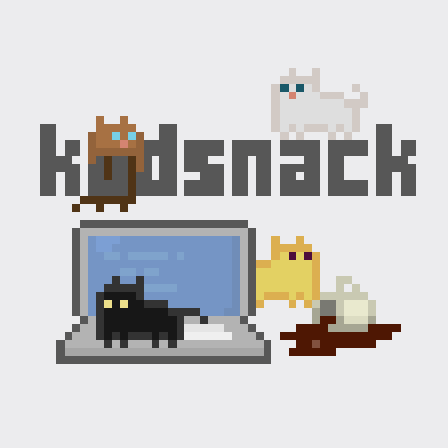

# Rotlösa Behållare

Note:
Jag ska prata om rotlösa behållare, eller

---


# Rootless Containers

Note:
Rootless containers som jag skulle säga. Det finns ingen bra svensk
översättning på det där, så det kommer bli en del svengelska.

---


Kristoffer Gr&ouml;nlund<br>kgronlund@suse.com

Note:
Mitt namn är Kristoffer Grönlund, jag jobbar på SUSE som är en
Linuxdistributör, jobbar hemifrån här i Sverige, SUSE är ett tyskt
företag, vi söker folk och är öppna för remote =)

---


Note:
Disclaimer, inte expert på containers.

---

<!-- .slide: data-background="#ececee" -->



kodsnack.se

Note:
Jag vill även passa på att nämna kodsnack som jag gör med några
kompisar, det är en podcast om programmering på svenska, nytt avsnitt
varje vecka.

---


opensuse.org

Note:
Tänkte också nämna openSUSE, SUSE släpper en helt öppen och fri
version av OSet, faktum är att vi utvecklar openSUSE först, allt nytt
hamnar där först. Det är en rullande distro precis som Arch, fast vi
har stabila releaser som motsvarar versionerna med betald support
också.

---

* Introduktion
* Containers..?
* Rootless containers
  * Varför
  * Hur

---

<!-- .slide: data-background-image="img/containers3.jpg" -->

Note:
OK, nog med reklam, här är det jag egentligen ska prata
om. Containrar. För att få ämnet som jag tänker komma till begripligt
så måste jag börja med att förklara vad en container är. Är det någon
som i stora drag kan förklara vad en container är? Hur man förklarar
beror lite på hur man ser på dem.

---

<!-- .slide: data-background-image="img/boxes.jpg" -->

Note:
Om vi med container menar att köra en process i en speciell miljö
lokalt på en maskin så ser de lite mer ut som de här lådorna, där man
stoppar sin process i en unik låda, inreder den precis som processen
vill ha det och ger den titthål till precis det den behöver se av
omvärlden. Vi börjar där.

---

# Kärnan

Note:
Containers bygger på ett par olika features i Linux-kerneln. I andra
operativsystem så ser det säkert lite annorlunda ut, men den generalla
iden är ungefär densamma.

---

# Namespaces

Isolerad vy av systemresurser

Note:

Namespaces används för att ge processen en unik bild av olika
systemresurser, t.ex. vilken process-id den själv har. 

---

* Mount (mnt)
* Process ID (pid)
* Network (net)
* Interprocess communication (ipc)
* **User ID (user)**
* ...

---

# CGroups

Begränsad tillgång till systemresurser

Note:

cgroups används för att ge processer begränsad tillgång till
delade fysiska resurser, t.ex. ge en process begränsad CPU-tid eller
begränsa hur mycket minne den får använda.

---

``` sh
# Example: set the maximum memory limit to 100MB
mkdir /sys/fs/cgroup/memory/<CGRP>
echo 100000000 > /sys/fs/cgroup/memory/<CGRP>/memory.limit_in_bytes
echo <PID> > /sys/fs/cgroup/memory/<CGRP>/cgroup.procs
```

---

<!-- .slide: data-background-image="img/ship.jpg" -->

Note:

Det andra sättet att se på containers är det som i alla fall jag
tänker på först, typ dockercontainer. Att man kan packa ihop allt en
process behöver till ett paket, och nu kan man köra processen på olika
system så länge de har docker.

---

# Manifest

Note:
Här är en container i princip ett packmanifest.

Manifestet beskriver vad som behövs för att starta och köra processen,
och hur processen ska startas.

---

# Runtime

Note:
Allt det här sköts av en container runtime. En runtime tar en
container, packar upp innehållet, läser manifestet, sätter upp
namespace, filsystem och cgroups och startar processen.

---


runc

Note:
Open Container Initiative är en öppen standard för
containerformat och runtimes. Donerat av Docker.

---

# Rootless

Note:

Sådär, nu när vi vet vad en container är så kan vi prata om
rotlöshet. Äntligen.

---

Att göra det möjligt för en opriviligerad användare att

* Skapa och köra containerprocesser, och
* Skapa och distribuera containerpaket till andra.

---

# Varför rootless?

---

## Python 3 vs. Python 2

---

## Extra säkerhetslager

---

blog.jessfraz.com/post/ultimate-linux-on-the-desktop

---

# Hur

---

namespaces / <del>cgroups</del>

---

# user namespaces

Låt processen i containern tro att den är PID 1. (!)

---

## `runc` emulerar otillåtna systemanrop

`setgroups`, `chown`, ...

---

## Skapa / distribuera containers

umoci

---

# Klart?

rootlesscontaine.rs

Rootless Containers with runC - Aleksa Sarai, SUSE

The Route to Rootless Containers - Claudia Beresford & Ed King, Pivotal

Note:

Inte riktigt. Mycket kvar att göra, t.ex. cgroups. Läs mer på rootlesscontaine.rs.

---

<!-- .slide: data-background="#02D35F" -->

SUSE Containers as a Service Platform

SUSE Cloud Application Platform

SUSE OpenStack Cloud

SUSE Linux High Availability

**suse.com/careers**
