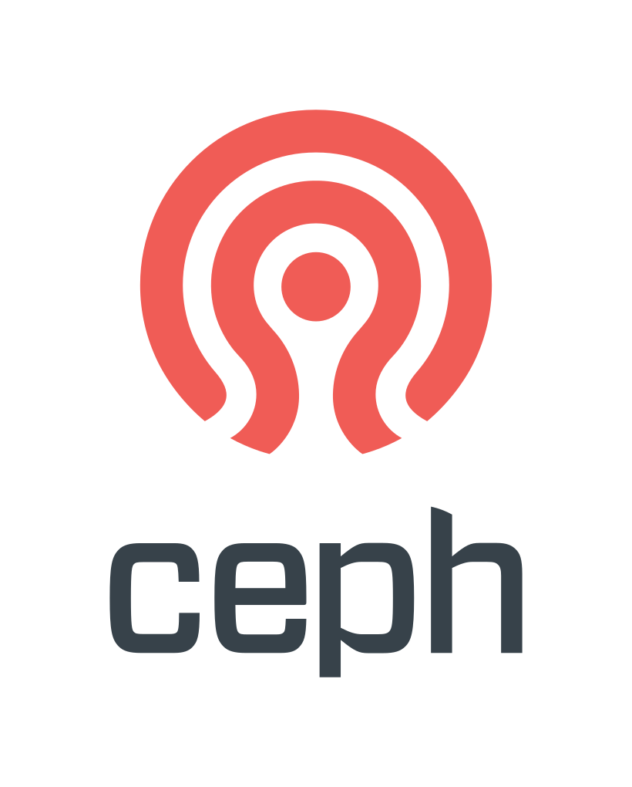
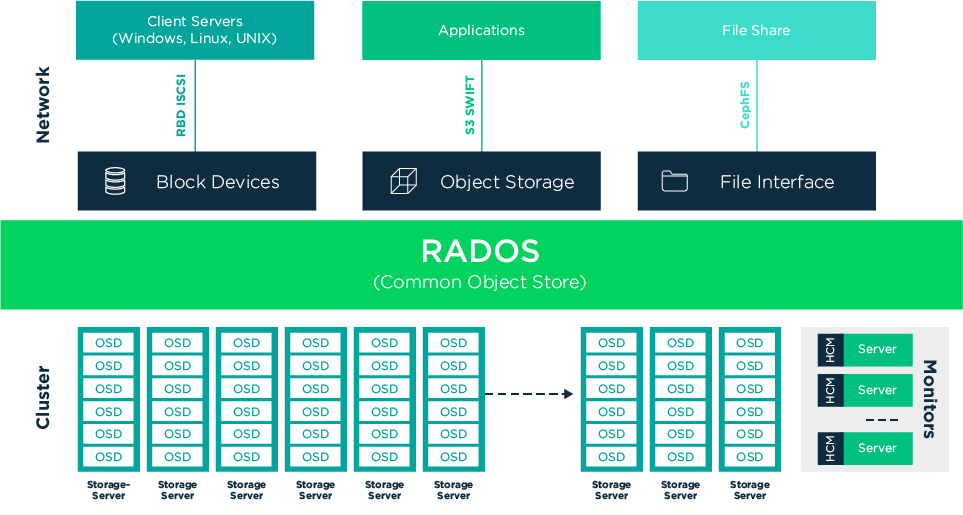
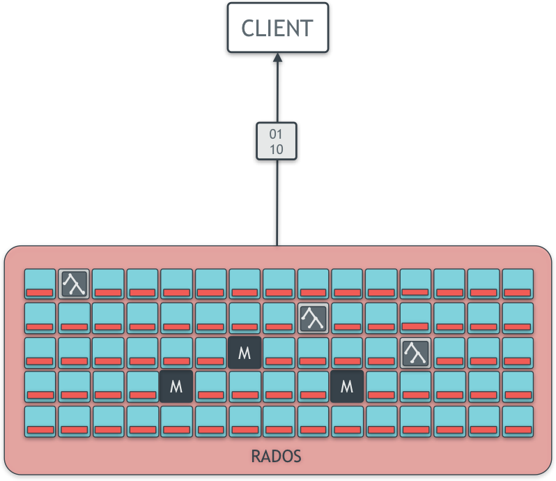
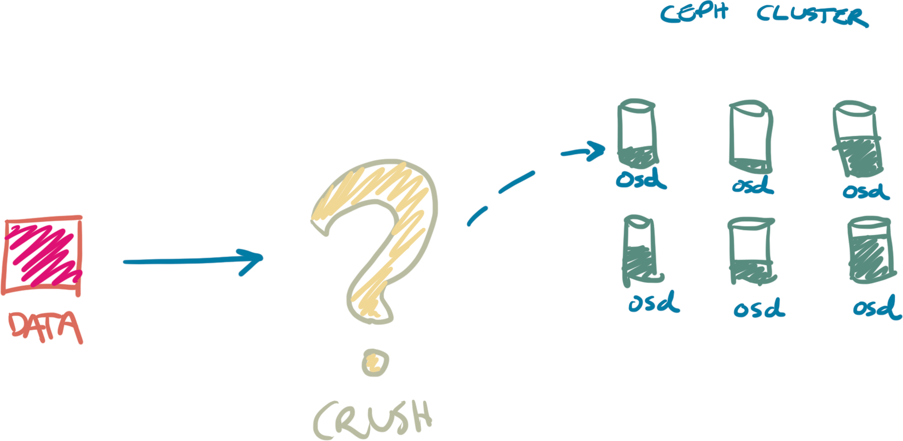
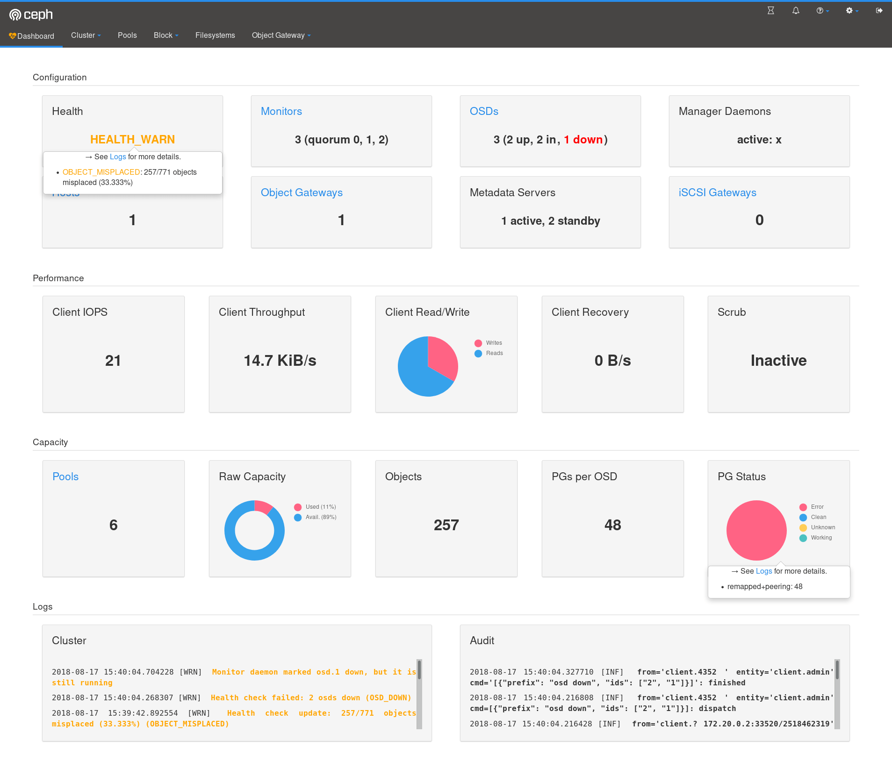
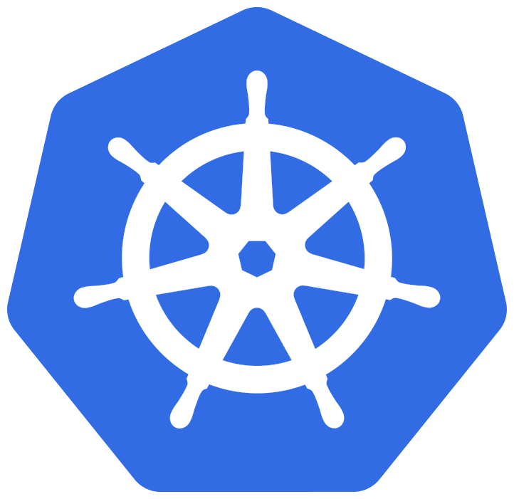
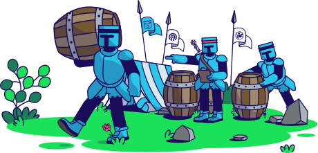
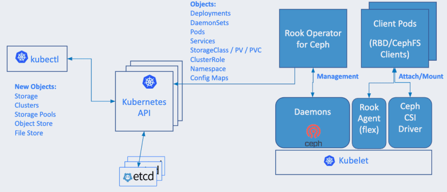

# Introducing
# Rook


<div style="font-size:0.5em;">Kristoffer Gr&ouml;nlund &lt;krig@koru.se&gt;</div>

Note:
About me; Work for SUSE; Storage team on rook

---

Ceph &bull; <b>Rook</b> &bull; Kubernetes

Note:

Going to talk about three different things: Ceph, Rook and Kubernetes.
Anyone unfamiliar with all of these? Won't be able to dig too deep.

---

# Software Defined Storage

Note:

Ceph is a Software Defined Storage solution.
Contrasted against buying a storage array from a vendor.
Pros: Cheaper, more flexible, adaptible, cloud compatible.
Cons: More complexity to handle.

---



&nbsp;

&nbsp;

* Open source (LGPL)
* Distributed
* Massively scalable
* Self healing
* Runs on commodity hardware / public cloud

Note:

Ceph
* Open source
* Distributed
* Massively scalable
* Self healing
* Runs on commodity hardware / public cloud


---

# One cluster, many interfaces

* Object
  * REST
  * S3, Swift
* Block
  * Mount as raw device
* File
  * POSIX file system
* librados
  * C, C++, Java, Python, Ruby, PHP

---

# RADOS

> Reliable Autonomic Distributed Object Store

Object store cluster made up of intelligent, self-managing
storage nodes and monitors.

---

# CRUSH

Algorithm used by both clients and the cluster to map
data objects to storage locations.

---

# OSD

Storage daemons, one per disk (SSD, HDD, NVMe).
Serves data to clients, handles peer to peer replication & recovery.

# MON

Monitor daemons maintain shared state and consensus.
Typically 3 - 5 per cluster.

---

# MGR

Manager daemons runs cluster services like the dashboard.

# MDS

MDS daemons handle file system metadata.

# RGW

RADOS Gateways provide REST APIs (S3, Swift, etc.)

---



---

### No Single Point Of Failure



---



Note:

CRUSH algorithm, the secret sauce of Ceph.

The CRUSH map is basically a hash function,
which allows clients to independently figure
out where the data they are looking for is
located without going through a directory
service.

---

# Why not a directory?

* Two stage lookup is slow
* Scalability
* Directory has to stay in sync

---

# Single step placement

* Hash the data directly to a location
* What happens when servers are added or removed?

---

# Two step placement

* Hash object to placement group
* Map placement group to location
* Can control number of data locations
* Can add or remove placement group locations

---

<b>HASH</b>(OBJECT NAME) &#x2192; PG ID

<b>CRUSH</b>(PG ID, TOPOLOGY) &#x2192; [OSD.11, OSD.24, OSD.92]

---

Fast, decentralized, scalable, flexible.

---



Note:

Comes with user-friendly tools,
management dashboard, prometheus
integration, etc.

---

# Kubernetes



Note:

Container orchestration platform.
Automate application deployment, scaling and management.

Handles service discovery, load balancing, rollouts and rollbacks.

Is self-healing.

Handles secrets and configuration management.

---

# Concepts

* Pod
* Service
* Namespace
* Controller
* Volume
* Custom Resource Definition (CRD)

Note:

Pod = basic execution unit of an app. One or more containers with resources like
storage, networking, runtime options.

Service = interface to an app, DNS name for a set of pods plus load balancing.

Namespace = organize the cluster.

Controllers create and manage replicated sets of Pods (DaemonSet, ReplicaSet).

Volume = Directory accessible by a Pod.

CRD = An interface for extending Kubernetes with new types.

---

# Kubernetes Storage Story

1. Volume Plugins

2. FlexVolume *

3. CSI *

Note:

how does storage work in Kubernetes? How can services access and store data?
Not going to talk about using databases here.
Kubernetes designed for stateless services.
Volume plugins provide interface to storage somewhere else.
Kubernetes assumes someone else sorts out storage.
CSI = Container Storage Interface

---


# Challenges
#### External Storage / Cloud Vendor

* Vendor lock-in
* Portability
* Connectivity
* Deployment
* Administration

Note:
You might say just use EBS or whatever storage the cloud vendor provides.
There are some issues with that though.
A big one (surprisingly) is cost.
Having storage "somewhere else" means dealing with connectivity between storage
and the applications. Deployment burden. Who manages this thing?

---



Note:

This is where Rook comes in.
Cloud-native Storage Orchestrator.
Extends Kubernetes with new primitives.
Configures and manages storage provides in Kubernetes,
and exposes storage to pods.

---


### Multiple storage providers

* **Ceph**
* **EdgeFS**
* CockroachDB
* Cassandra
* NFS
* Yugabyte DB
* Apache Ozone

Note:
Rook is a framework for multiple storage systems.
Ceph and EdgeFS are stable, the rest are either
in beta or alpha state as of rook 1.2.

---

# Automation

* Deployment
* Configuration
* Scaling
* Upgrading
* Migration
* Disaster Recovery
* ...

Note:

Rook turns storage software into self-managing, self-scaling, and self-healing storage services. It does this by automating deployment, bootstrapping, configuration, provisioning, scaling, upgrading, migration, disaster recovery, monitoring, and resource management. Rook uses the facilities provided by the underlying cloud-native container management, scheduling and orchestration platform to perform its duties.

---

# Rook Operator

* Bootstrap and Monitor
* Manages Ceph
* Creates Agents

Note:
* Bootstraps and monitors the storage cluster
* Manages Ceph MONs and a DaemonSet for OSDs
* CRDs for pools, object stores and file systems
* Creates Rook agents

---

# Rook Agents

* Runs on all nodes
* Handles storage operations

Note:
* Deployed on every Kubernetes node
* Handles storage operations
  * Attach network storage
  * Mount volumes
  * Format file systems

---

* Persistent Volume (PV)
* Persistent Volume Claim (PVC)
* Storage Classes

Note:

* **Persistent Volume (PV)**
  * Actual slice of storage
  * Manually provisioned by administrator, or
  * Dynamically provisioned by Storage Classes
  * Independent lifetime from Pods

* **Persistent Volume Claim (PVC)**
  * Request for storage
  * Consumes PV resources
  * Can request specific size, access mode
  
* **Storage Classes**
  * Defines types of storage available
  * Enable dynamic storage provisioning
  * Cluster creates and assigns PVs to PVCs

---



Note:

Architecture overview.
Important parts have blue background:
Rook manages the storage provider (ceph)
Exposes storage to pods.

---

# Use Case: Pure Ceph Cluster

* Dedicated K8S cluster for running Ceph
* Can serve multiple K8S application clusters
* Not common

---

# Use Case: Shared Cluster

* One partitioned K8S cluster
* Dedicated storage nodes for Ceph
* Dedicated compute nodes for Apps

---

# Use Case: Unified Cluster

* All nodes run both Ceph and workloads
* Most common

---

# Use Case: External Cluster

* Rook as interface to external Ceph cluster
* Added in Rook v1.1

---

# Prerequisites

&#10003; Kubernetes cluster (v1.12+)

&nbsp;

### One of the following:

* Raw devices (no partitions or filesystems)
* Raw partitions (no filesystem)
* Available PVs from storage class in `block` mode

---

### Try it out

<asciinema-player id="terminal-player" src="/js/ceph.cast" cols="61" rows="18"
theme="monokai" font-size="big"></asciinema-player>

Note:

I'll show the steps to setting up a cluster,
then go through them in more detail.
Rook comes with example yaml files for
creating ceph clusters.

---

`kubectl create -f common.yaml`

`kubectl create -f operator.yaml`

<br>

* Create common resources for rook
  * Edit to deploy in different k8s namespace
* Create Rook operator
  * Options include log level, feature flags
* Helm chart

---

`kubectl create -f cluster.yaml`

<br>

* Which nodes/devices to use (default: all nodes, all devices)
* How many mons, mgrs, gateways to deploy
* Deploy prometheus for monitoring
* Ceph version to deploy

---

<pre class="stretch">
<code data-trim class="hljs yaml">
# cat object.yaml
apiVersion: ceph.rook.io/v1
kind: CephObjectStore
metadata:
  name: my-store
  namespace: rook-ceph
spec:
  metadataPool:
    failureDomain: host
    replicated:
      size: 3
  dataPool:
    failureDomain: host
    erasureCoded:
      dataChunks: 2
      codingChunks: 1
  preservePoolsOnDelete: true
  gateway:
    type: s3
    sslCertificateRef:
    port: 80
    securePort:
    instances: 1
</code>
</pre>

Note:
Create an object store

---

```sh
# Create the object store
kubectl create -f object.yaml

# To confirm the object store is configured, wait for the rgw pod to start
kubectl -n rook-ceph get pod -l app=rook-ceph-rgw
```

---

### Dashboard

```
 spec:
    dashboard:
      enabled: true
```

<hr>

```
kubectl -n rook-ceph get service
NAME                         TYPE        CLUSTER-IP       EXTERNAL-IP   PORT(S)          AGE
rook-ceph-mgr                ClusterIP   10.108.111.192   <none>        9283/TCP         3h
rook-ceph-mgr-dashboard      ClusterIP   10.110.113.240   <none>        8443/TCP         3h
```

---

### Toolbox

```
kubectl create -f toolbox.yaml
kubectl -n rook-ceph exec -it \
    $(kubectl -n rook-ceph get pod \
      -l "app=rook-ceph-tools" \
      -o jsonpath='{.items[0].metadata.name}') \
    bash
# ceph status
```

Note:

The Rook toolbox is a container with common tools used for rook debugging and testing.

---

rook.io

Note:

There's a lot more to it, for more info and docs see rook.io

---

# Conclusion


Note:

why use Rook? If you need Storage and are running Kubernetes,
there really isn't anything else that compares.

Provides Storage within Kubernetes. Consistent interface wherever Kubernetes
runs, different cloud providers, on premise, etc.

Version 1.2.7 released recently. Ceph backend most mature.
Ceph itself is proven technology, running in production since 2012.

Avoid lock-in, gain scalability, flexibility.

---


**suse.com/storage**

<hr>

* SUSE Storage 6
  * Technology Preview
* SUSE Storage 7
  * Full support

Note:

For a supported option, SUSE has a tech preview out now, and in
the next release SES will be fully supported on CaaSP, the SUSE K8S
distribution.
